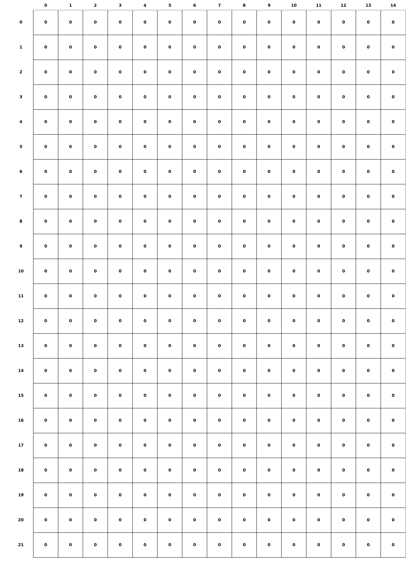
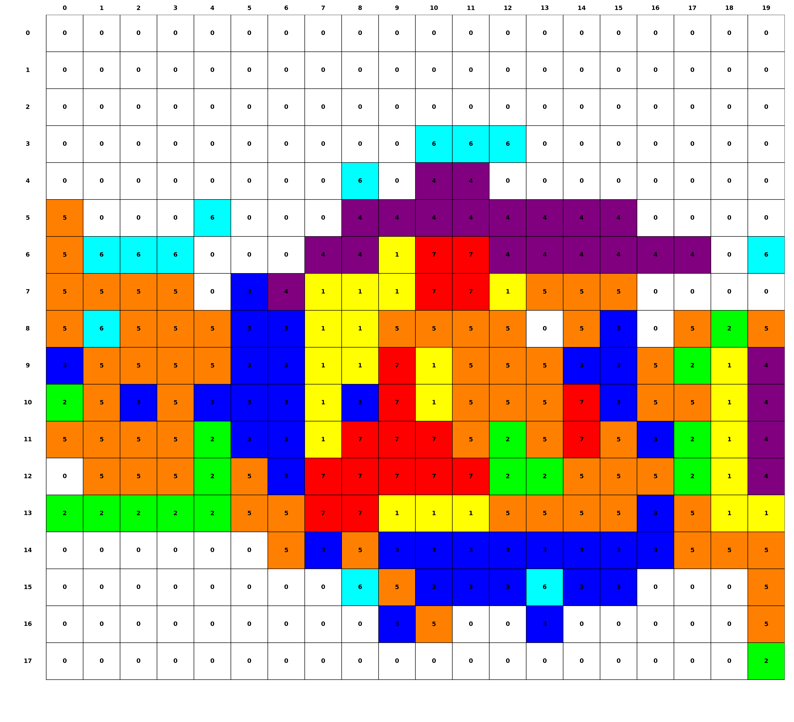
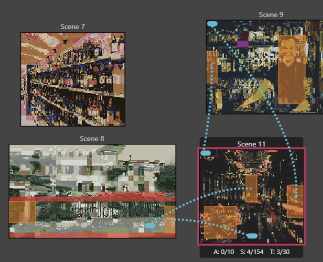

# 🎨 Pyxel Morph

Pyxel Morph is a software tool for **graphic design in game development through GB STUDIO**. It converts your input images into green-shaded previews, helping you quickly map colors into palettes for your game scenes, in addition to a MAPPING FILE and a PALETTE LIST that can be inserted directly into gbstudio. No more need to make a green shaded image from scratch: the app will do that for you.

---

# How to use (free user manual)

STEP 1: choose any image you want

STEP 2: make sure length and height are divisible by 8 (ADVICE: use libresprite)

STEP 3: quantize your image on a free app (ADVICE: use rilden, select 5 palettes containin 4 colors for best results; play with dithering for best results on rilden)

STEP 4: save quantised image, do not save the palette file, Pyxel morph already does that

STEP 5: use a free app (ADVICE: use libresprite) to reduce the number of colors in your image to 11 or less, and save the resulting image.

STEP 6: Open Pyxel Morph, select output folder (ADVICE: choose the output folder in the app folder) and the fully compliant and quantised image as input image (NOTE: if not quantised, free version has an approximate quantising function incorporated in the exact green preview operation, however it is advised to use more powerful quantiser for better results)

STEP 7: click the exact green preview button, and once the operation is finished (after 1 or 2 seconds) open your output folder: you should find a file for each palette used, the original image you put in input, the green preview, and the tile grid; any other files are not needed for the recoloring

STEP 8: FOR FIRST USE, it is advised to open each palette file .gbsres in a text editor, and manually paste the 4 hex values between the square brackets "[]" in order into the "find closest hex" text insert in palette editor, and naming them appropriately (example: my_palette_0, my_palette_1,...,my_palette_4).

STEP 9: Now that the palettes have been inserted, rename the green preview in output to whichever name you prefer, and move it inside the background folder in assets of your game folder; then go back to GB studio, create a scene and set the background image as the green preview you just imported. After clicking on the new scene, in your right panel, you will see 8 4-color palettes: change them with your new palettes, from _0 to _4 or whichever number of palettes you are using (_7 or _8 is advised for higher tiers).

STEP 10: Start painting! Move to paint mode on GB studio within your current scene, and open in a side window the tile grid image from your output folder. The grid shows squares filled of different colors depending on the palette id (the number shown in the center of each square), it's up to you to find the most efficient way to color your image

STEP 8 ADJUSTED: FOR ADVANCED USERS, still in free option, it is possible to move your palette files directly to your project-palettes folder in your game folder; if you intend to follow this path, READ CAREFULLY to avoid disappearance of your palettes on reopening.

8a: rename your palettes in the output folder from exit_0 to yourname_0 or whatever you choose

8b: open each palette in text editor, change the title to yourname_0, save (ctrl+S) and repeat for each palette (from_0 to _4 or whatever)

8c: move all your renamed palettes into the project-palettes folder in your game folder, and after open your game

8d: select as your scene palettes the new renamed palettes: they will appear in your choices if you have saved all previous modifications in previous steps; THEN SAVE, AND CLOSE GB STUDIO

8e: open your project-palettes folder in your game folder: you will see only .gbsres.bak files: delete .bak for all of your renamed palettes by renaming (only these new palettes, not other palettes in that folder); a warning will appear, just click ok and repeat for each of the new palettes

8f: open your game once again in gb studio, and if the palettes are no longer there in your new scene, simply put them back in as before; now your project palette folder will contain .gbsres and .gbsres.bak palette files, so it is now absolutely impossible that your palettes disappear from the folder or the game. Procede with steps 9 and 10.

## 📥 Getting Started

1. **Download** the latest release from the [Releases page](https://github.com/contactpyxelmorph-afk/Pyxel-Morph/releases).  
2. Extract the ZIP.  
3. Launch `PyxelMorph.exe` on Windows.  

---

## 💎 Subscription Tiers

| Tier     | Max Palettes | Max Input Colors | Can Use Complex Image Optimization | Price |
|----------|--------------|-----------------|----------------------|-------|
| Free     | 5            | 10              | ❌                    | Free  |
| Pro      | 7            | 11              | ✅                   | €1.50 for life |
| Diamond  | Unlimited    | Unlimited       | ✅                   | €2.50 for life |

> Note: Maximum 2 priority colors for all tiers. Only 8x8 tiles supported; at the moment it is advised to quantise through Rilden, Pyxel Morph will output from that given image all the necessary files as shown in the preview.

---

## 📁 Folder Structure

- `PyxelMorph.exe` – Application executable  
- `PyxelMorph.lnk` – Shortcut  
- `manual/` – User manual PDF  
- `output/` – Folder where generated files will be saved  
- `legal/` – EULA, Privacy Policy, Privacy Notice  

---

## ⚖️ Legal

- Using Pyxel Morph is governed by the **EULA** and **Privacy Policy** included in the `legal/` folder.  
- By registering and using the app, you consent to these terms.

---
## 🖼️ Screenshots

Input image → Green preview → Recolored output:

tile grid using 4 colors (1 palette):

tile grid using 8 palettes:

note: in scene 8 I pasted the palette colors on the color panel rather than the find-closest-hex panel, so colors are a bit mismatched; took 25 minutes to color each image with tile_grid

Pin-point accuracy from latest update

## 📬 Support

For any questions or issues, contact us at:  
**contact.pyxelmorph@gmail.com**

pricing information here is correct at all times; disregard inconsistencies between alterantive manual or read me files; cancel subscription button should be no longer functional, now that fixed prices come into effect

