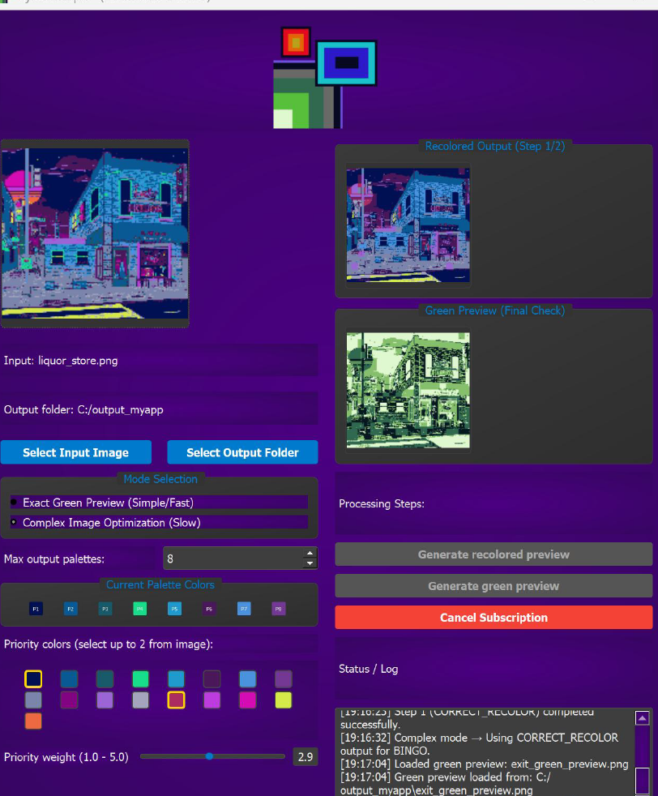

# 🎨 Pyxel Morph

Pyxel Morph is a software tool for **graphic design in game development**. It converts your input images into green-shaded previews, helping you quickly map colors into palettes for your game scenes.

---

## 📥 Getting Started

1. **Download** the latest release from the [Releases page](https://github.com/contactpyxelmorph-afk/Pyxel-Morph/releases).  
2. Extract the ZIP.  
3. Launch `PyxelMorph.exe` on Windows.  

---

## 💎 Subscription Tiers

| Tier     | Max Palettes | Max Input Colors | Can Use Complex Image Optimization | Price |
|----------|--------------|-----------------|----------------------|-------|
| Free     | 5            | 10              | ❌                    | Free  |
| Pro      | 7            | 11              | ✅                   | €0.50/month |
| Diamond  | Unlimited    | Unlimited       | ✅                   | €1/month |

> Note: Maximum 2 priority colors for all tiers. Only 8x8 tiles supported.

---

## 📁 Folder Structure

- `PyxelMorph.exe` – Application executable  
- `PyxelMorph.lnk` – Shortcut  
- `manual/` – User manual PDF  
- `output/` – Folder where generated files will be saved  
- `legal/` – EULA, Privacy Policy, Privacy Notice  

---

## ⚖️ Legal

- Using Pyxel Morph is governed by the **EULA** and **Privacy Policy** included in the `legal/` folder.  
- By registering and using the app, you consent to these terms.

---
## 🖼️ Screenshots

Input image → Green preview → Recolored output:

## 📬 Support

For any questions or issues, contact us at:  
**contact.pyxelmorph@gmail.com**

